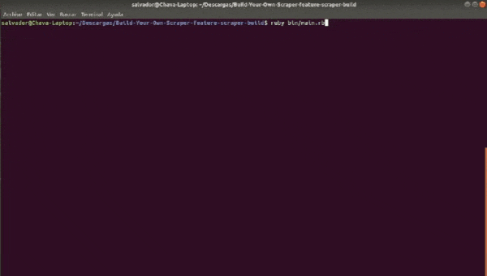

# Microverse - Ruby Capstone Project - Build your own scraper

This project creates a Scraper that allows the user to search coding articles on [Hackernoon](https://hackernoon.com/tagged/ruby) web site using keywords. And shows the results that match the keywords in an HTML file. The file after the search is located in searches folder. 

I build this scraper to help people to optimize their time that spends looking for articles related to a specific topic on the Hackernoon website.



## Getting Started

To get started, you should first get this file in your local machine by downloading this project or typing.
 
```git
git clone https://github.com/Salvador-ON/Build-Your-Own-Scraper
```

### Prerequisites

Before you start using the scraper, you need to be sure that you have Ruby installed on your computer, by typing.

```
ruby -v
```

and it should return something like.

####### ruby 2.6.##### (20##-##-## revision 6####) [########]

If it's not installed in your system, follow this [guide](https://www.ruby-lang.org/en/documentation/installation/) and it will help you to get it done.


## Running the Program 

You need to open your terminal and go to the downloaded folder, then You need to run the next command to install the gems.

```
bundle install
```

Then you can run the next command that starts the program.

```
ruby bin/main.rb
```

When the program starts, It is going to ask you to type the keywords separated by a space, remember to only use keywords to optimize the search.

```
ruby rails
```
By default, the target of Scraper right now is the coding Ruby section but you can change to any other Hackernoon section. You only need to change the URL that is in the initialize of the Browser class.

```
@browser.goto 'https://hackernoon.com/tagged/ruby'
```

## Test-driven development RSPEC

The code includes unit testing using RSpec. To start the test run the next line in your terminal:

```
rspec
```

## Trouble Shooting

If you have a slow internet connection you can increment the wait time of the parsed_wait method that it is located in lib/browser.rb. Changing the number of sleep seconds. So the scraper could be able to change to other pages in the correct time.

```
sleep(1)
```

## Built With

* [Ruby](https://www.ruby-lang.org)


## Author

**Salvador Olvera**
- Linkedin: [Salvador Olvera](https://www.linkedin.com/in/salvador-olvera-n)
- Github: [@Salvador-ON](https://github.com/Salvador-ON)
- Twitter: [@Salvador Olvera_ON](https://twitter.com/Salvador_ON)


## Contributing

Contributions, issues, and feature requests are welcome!

Feel free to check the [issues page](./issues/).

## Show your support

Give a start if you like this project!

## License

This project is [MIT](lic.url) licensed.
